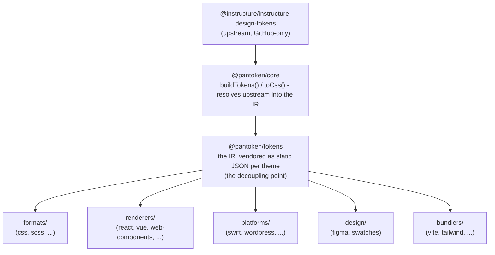

# Arquitetura

pantoken tem um trabalho: resolver os design tokens e ícones da Instructure uma vez, e então remodelar esse modelo
para cada destino. As camadas abaixo mantêm essa remodelagem honesta e mantêm os pacotes publicados livres
de qualquer upstream exclusivo do GitHub.

## As camadas

- **`@pantoken/model`** contém os contratos de tipo, e nada mais. É a fonte da verdade para a
  forma `Token` e o contrato de plugin, sem dependências, para que qualquer pacote possa depender dele
  livremente.
- **`@pantoken/core`** é o único pacote que toca a fonte upstream. Ele resolve tokens e
  ícones no IR canônico e gera CSS.
- **`@pantoken/tokens`** fornece esse IR como JSON estático em tempo de build. Este é o ponto de desacoplamento:
  pacotes downstream leem `@pantoken/tokens`, nunca `@pantoken/core`, então `npm i pantoken` nunca
  acessa o upstream exclusivo do GitHub.
- **`@pantoken/utils`** carrega os helpers compartilhados — o resolvedor `var(--x)`, as regexes de referência,
  conversão de caso e de cor, e as checagens de deriva que mantêm a saída gerada fiel ao IR.

## Por que os tokens são fornecidos como vendor

O pacote upstream de tokens vive no GitHub, não no npm. Se todo pacote downstream dependesse dele,
`npm i pantoken` falharia para qualquer pessoa sem esse acesso. Em vez disso, `@pantoken/tokens` resolve o
upstream uma vez em tempo de build e grava o resultado em JSON estático. Os pacotes publicados carregam esse
JSON, então são instaláveis diretamente do npm, travam em semver, e funcionam offline.

## Buckets

Cada bucket downstream é uma forma de consumir o IR:

- **formats/** — transforma os tokens em um arquivo (CSS, SCSS, Less, Stylus, DTCG).
- **renderers/** — integrações com frameworks e ferramentas (React, Vue, Svelte, MUI, Pendo e mais).
- **bundlers/** — plugins e presets para ferramentas de build (Vite, Next, Tailwind, Panda, PostCSS, webpack).
- **platforms/** — alvos nativos e geradores de site (Swift, Kotlin, Rust, WordPress, Drupal).
- **design/** — payloads para ferramentas de design (Figma, paletas de cores).
- **plugins/** — transformações opcionais que estendem o token ou a saída CSS. Ver [Plugins](/guide/plugins).

## Saída gerada

Todo pacote que emite um arquivo grava-o em um diretório `generated/` por pacote que um build
reproduz, então nada gerado é commitado. Uma tarefa do workspace valida tudo isso. Veja
[Saída gerada](/guide/generated-output).
