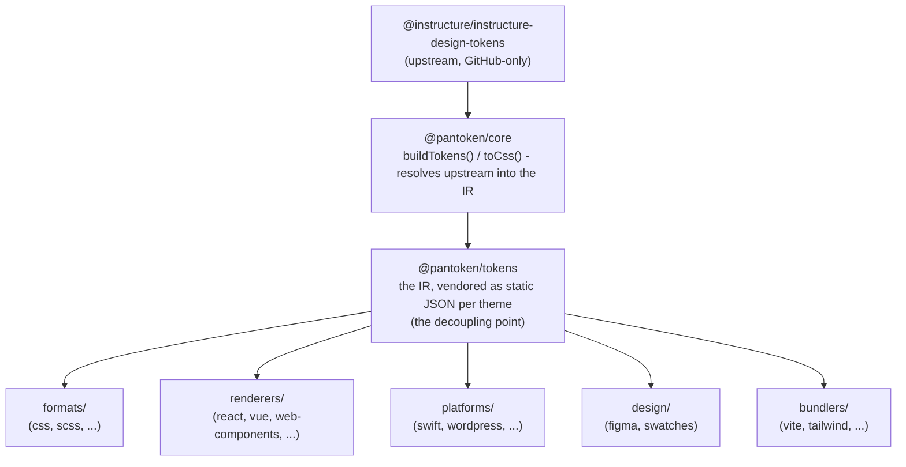

# Архитектура

pantoken выполняет одну задачу: один раз разрешить (resolve) дизайн-токены и иконки Instructure, затем преобразовать эту модель
для каждой целевой платформы. Уровни ниже обеспечивают честность этого преобразования и сохраняют публикуемые пакеты свободными
от любого GitHub-only upstream.

## Уровни

- **`@pantoken/model`** содержит контракт типов и больше ничего. Это источник истины для
  формы `Token` и контракта плагина, без зависимостей, поэтому любой пакет может свободно зависеть от него.
- **`@pantoken/core`** — единственный пакет, который взаимодействует с upstream-источником. Он разрешает токены и
  иконки в канонический IR и рендерит CSS.
- **`@pantoken/tokens`** поставляет этот IR как статический JSON во время сборки. Это точка декуплинга:
  downstream-пакеты читают `@pantoken/tokens`, никогда не читают `@pantoken/core`, поэтому `npm i pantoken` никогда не
  добирается до GitHub-only upstream.
- **`@pantoken/utils`** содержит общие хелперы — резолвер `var(--x)`, регулярные выражения для ссылок,
  преобразования регистра и цвета, а также проверки дрейфа, которые сохраняют соответствие сгенерированного вывода IR.

## Почему токены вендорятся

Upstream-пакет токенов находится на GitHub, а не в npm. Если бы каждый downstream-пакет зависел от него,
`npm i pantoken` не смог бы установиться у кого-либо без доступа. Вместо этого `@pantoken/tokens` разрешает
upstream один раз во время сборки и записывает результат в статический JSON. Публикуемые пакеты включают этот
JSON, поэтому они корректно устанавливаются из npm, фиксируются семвером и работают офлайн.

## Бакеты

Каждый downstream-бакет — это способ потребления IR:

- **formats/** — превращает токены в файл (CSS, SCSS, Less, Stylus, DTCG).
- **renderers/** — интеграции с фреймворками и инструментами (React, Vue, Svelte, MUI, Pendo и др.).
- **bundlers/** — плагины и пресеты для сборщиков (Vite, Next, Tailwind, Panda, PostCSS, webpack).
- **platforms/** — нативные и site-generator цели (Swift, Kotlin, Rust, WordPress, Drupal).
- **design/** — полезные данные для дизайнерских инструментов (Figma, цветовые свотчи).
- **plugins/** — опциональные трансформации, расширяющие токены или вывод CSS. См. [Plugins](/guide/plugins).

## Сгенерированный вывод

Каждый пакет, который выводит файл, записывает его в per-package директорию `generated/`, которую воспроизводит сборка,
поэтому ничего сгенерированного не коммитится. Задача workspace валидирует всё это. См.
[Generated output](/guide/generated-output).
