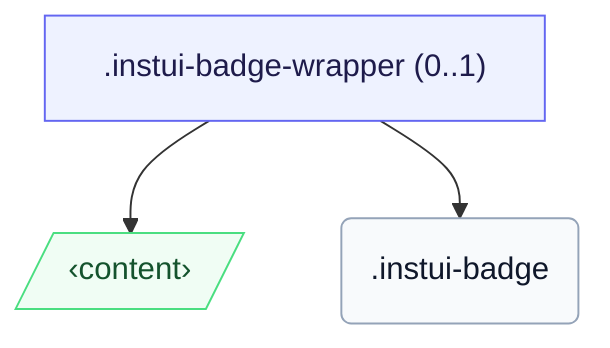

# CSS: badge

`.instui-badge` — A small count or status dot placed over a target's corner.

To place a badge over a target, wrap both in a `.instui-badge-wrapper` (the position anchor) and pin the badge with a `-placement-*` modifier.

**Source:** [badge.css](https://github.com/thedannywahl/pantoken/blob/main/formats/components/src/components/badge/badge.css)

## Buktáhašvuohta

```css
@import "@pantoken/components/components.css";
@import "@pantoken/components/badge.css";
```

## Demoo

```demo
self:badge
```

## Exempla

```html
<span class="instui-badge-wrapper">
  <button class="instui-button">Inbox</button>
  <span class="instui-badge -placement-top-end">4</span>
</span>
```

## Structura

The badge renders inline on its own, or inside an optional `instui-badge-wrapper` that anchors it over a target.

```text
.instui-badge-wrapper (0..1)
  ‹content›
  .instui-badge
```



## Modifisuvnnat

| Modifiserer | Deskripción |
| --- | --- |
| `.-color-danger` | An attention/error count. |
| `.-color-inverse` | On-dark: a light chip with dark text. |
| `.-color-success` | A positive/complete count. |
| `.-placement-bottom-end` | Position at the bottom-end corner. |
| `.-placement-bottom-start` | Position at the bottom-start corner. |
| `.-placement-end-center` | Position centred on the end edge. |
| `.-placement-start-center` | Position centred on the start edge. |
| `.-placement-top-end` | Position at the top-end corner. |
| `.-placement-top-start` | Position at the top-start corner. |
| `.-pulse` | A pulsing attention ring. |
| `.-standalone` | Render inline, not positioned over a target's corner. |
| `.-type-notification` | A dot only, no count. |

## Pseudo-elementtat

| Pseudo-element | Deskripción |
| --- | --- |
| `::before` | The pulsing attention ring drawn in the badge's accent colour (the `-pulse` variant). |

## Ovvun-propertijat

| Property | Type | Default | Deskripción |
| --- | --- | --- | --- |
| `--pantoken-badge-accent` | `<color>` | — | The chip fill; each `-color-*` variant and the pulse ring read from it. |
| `--pantoken-badge-text` | `<color>` | — | The text colour, paired to the accent so it stays legible. |

## Animasjonat

| Animasjon | Deskripción |
| --- | --- |
| `pantoken-badge-pulse` | The pulse ring animation. |

## Tokenat gaskkalit

| Token | Type | Vaššun |
| --- | --- | --- |
| `--instui-border-width-md` | `<length>` | `0.125rem` |
| `--instui-component-badge-border-radius` | `<length>` | `999rem` |
| `--instui-component-badge-color` | `<color>` | `#ffffff` |
| `--instui-component-badge-color-danger` | `<color>` | `#E62429` |
| `--instui-component-badge-color-inverse` | `<color>` | `#273540` |
| `--instui-component-badge-color-primary` | `<color>` | `light-dark(#1D354F, #EEF4FD)` |
| `--instui-component-badge-color-success` | `<color>` | `#03893D` |
| `--instui-component-badge-font-family` | `[ <font-family-name> \| <generic-font-family> ]#` | `Atkinson Hyperlegible Next, "Helvetica Neue", Helvetica, Arial, sans-serif` |
| `--instui-component-badge-font-size` | `<length>` | `0.75rem` |
| `--instui-component-badge-font-weight` | `<integer>` | `600` |
| `--instui-component-badge-padding` | `<length>` | `0.25rem` |
| `--instui-component-badge-size` | `<length>` | `1rem` |
| `--instui-spacing-space-sm` | `<length>` | `0.5rem` |

## Dálkkodat

- [pill](/se/api/css/pill.md) — The inline label-chip counterpart.

