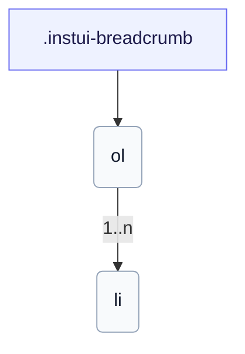

# CSS: breadcrumb

`.instui-breadcrumb` · <span class="instui-pill -color-success pantoken-doc-tag">stable</span> — A breadcrumb trail with separators; the last crumb is the current page.

Automatically collapses to a back arrow on small screens. Use `breadcrumb.link` for each crumb.

**Source:** [breadcrumb.css](https://github.com/thedannywahl/pantoken/blob/main/formats/components/src/components/breadcrumb/breadcrumb.css)

## Guhkkinjohka

Wrap the `&lt;ol&gt;` in a `<nav aria-label>` landmark; mark the current page's crumb with `aria-current="page"`.

## Buktáhašvuohta

```css
@import "@pantoken/components/components.css";
@import "@pantoken/components/breadcrumb.css";
```

## Exempla

```html
<nav class="instui-breadcrumb" aria-label="Breadcrumb">
  <ol>
    <li>
      <a class="-icon-house" href="#">Home</a>
    </li>
    <li><a href="#">Guides</a></li>
    <li><a href="#">Components</a></li>
    <li aria-current="page">Breadcrumb</li>
  </ol>
</nav>
```

## Structura

```text
.instui-breadcrumb
  ol
    li (1..n)
```



## Modifisuvnnat

| Modifiserer | Deskripción |
| --- | --- |
| `.-size-large` | Large. @affects breadcrumb.link — Scales the crumb separator's spacing to match. Long-form alias of `-size-lg`. |
| `.-size-lg` | Large. @affects breadcrumb.link — Scales the crumb separator's spacing to match. |
| `.-size-md` | Medium (default). @affects breadcrumb.link — Scales the crumb separator's spacing to match. |
| `.-size-medium` | Medium (default). @affects breadcrumb.link — Scales the crumb separator's spacing to match. Long-form alias of `-size-md`. |
| `.-size-sm` | Small. @affects breadcrumb.link — Scales the crumb separator's spacing to match. |
| `.-size-small` | Small. @affects breadcrumb.link — Scales the crumb separator's spacing to match. Long-form alias of `-size-sm`. |

## Tokenat gaskkalit

| Token | Type | Vaššun |
| --- | --- | --- |
| `--instui-component-breadcrumb-gap-lg` | `<length>` | `0.5rem` |
| `--instui-component-breadcrumb-gap-md` | `<length>` | `0.25rem` |
| `--instui-component-breadcrumb-gap-sm` | `<length>` | `0.125rem` |
| `--instui-component-link-font-family` | `[ <font-family-name> \| <generic-font-family> ]#` | `Atkinson Hyperlegible Next, "Helvetica Neue", Helvetica, Arial, sans-serif` |
| `--instui-component-link-font-size-lg` | `<length>` | `1.75rem` |
| `--instui-component-link-font-size-md` | `<length>` | `1rem` |
| `--instui-component-link-font-size-sm` | `<length>` | `0.875rem` |

## Almmuhuvvot komponenttat

- [breadcrumb.link](/se/api/css/breadcrumb.link.md)

