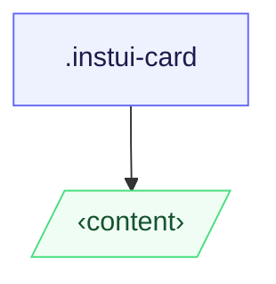

# CSS: card

`.instui-card` — A surface container that accepts arbitrary content.

**Variant** controls how direct children are styled: `content` (default) leaves them
  unstyled; `container` stacks them as bordered, padded sections. Padding scales with
  viewport width and is the same across both variants.
  **Size** is fully responsive — padding and border-radius step up automatically at 320px
  (20rem) and 640px (40rem) via standard `min-width` media queries; no size class is needed.
  Pair with `@pantoken/components` for heading, button, and other inline components.

## Guhkkinjohka

Use `&lt;article&gt;` as the card element when the card is a self-contained unit of content;
  use `&lt;section&gt;` when grouped within a larger landmark. In `-variant-container`, prefer
  `&lt;section&gt;` elements as direct children so each bordered region carries semantic meaning.

## Buktáhašvuohta

@import "@pantoken/plugin-custom-components/custom-components.css";

```css
@import "@pantoken/plugin-custom-components/custom-components.css";
```

## Exempla

Content card -nocard
```html
<article class="instui-card">
  <h2 class="instui-heading -h3">Card title</h2>
  <p>Content here.</p>
  <button class="instui-button">Action</button>
</article>
```
Container card -nocard
```html
<article class="instui-card -variant-container">
  <section>First section</section>
  <section>Second section</section>
</article>
```

## Structura

```text
.instui-card
  ‹content›
```



## Modifisuvnnat

| Modifiserer | Deskripción |
| --- | --- |
| `.-variant-container` | Container card; direct children become bordered, padded sections. |
| `.-variant-content` | Standard content card; children are unstyled. Default when no variant is set. |

## Divottat / Kondišuvnnat

| Type | Kysimus | Deskripción |
| --- | --- | --- |
| media | `(min-width: 20rem)` | — |
| media | `(min-width: 40rem)` | — |

## Tokenat gaskkalit

| Token | Type | Vaššun |
| --- | --- | --- |
| `--instui-component-card-background-color` | `<color>` | `light-dark(#ffffff, #1C222B)` |
| `--instui-component-card-border-radius-base-lg` | `<length>` | `1rem` |
| `--instui-component-card-border-radius-base-md` | `<length>` | `1rem` |
| `--instui-component-card-border-radius-base-sm` | `<length>` | `0.75rem` |
| `--instui-component-card-border-radius-nested-lg` | `<length>` | `0.75rem` |
| `--instui-component-card-border-radius-nested-md` | `<length>` | `0.5rem` |
| `--instui-component-card-border-radius-nested-sm` | `<length>` | `0.5rem` |
| `--instui-component-card-nested-border-color` | `<color>` | `light-dark(#E8EAEC, #2D3D49)` |
| `--instui-component-card-padding-base-lg` | `<length>` | `1.5rem` |
| `--instui-component-card-padding-base-md` | `<length>` | `1rem` |
| `--instui-component-card-padding-base-sm` | `<length>` | `0.75rem` |
| `--instui-component-card-padding-nested-lg` | `<length>` | `1rem` |
| `--instui-component-card-padding-nested-md` | `<length>` | `0.75rem` |
| `--instui-component-card-padding-nested-sm` | `<length>` | `0.5rem` |
| `--instui-component-shared-tokens-spacing-gap-cards-nested-containers-lg` | `<length>` | `1rem` |
| `--instui-component-shared-tokens-spacing-gap-cards-nested-containers-md` | `<length>` | `0.75rem` |
| `--instui-component-shared-tokens-spacing-gap-cards-nested-containers-sm` | `<length>` | `0.5rem` |
| `--instui-component-shared-tokens-stroke-width-sm` | `<length>` | `0.0625rem` |
| `--instui-elevation-card` | `none \| <shadow>#` | — |

## Browsera geavahit

- `@scope` is Baseline 2023 Newly Available; the card degrades to an unscoped flat stylesheet
  in older browsers with no loss of visible styling.

## Dálkkodat

- [heading](/se/api/css/heading.md) — Place directly in the card or inside a container section.
- [button](/se/api/css/button.md) — Place directly in the card or inside a container section.
- [img](/se/api/css/img.md) — Place directly in the card as a media region.
- [badge](/se/api/css/badge.md) — Place directly in the card as a status indicator.

## Lihkki sáhttu

- https://drafts.csswg.org/css-cascade-6/#scoping

