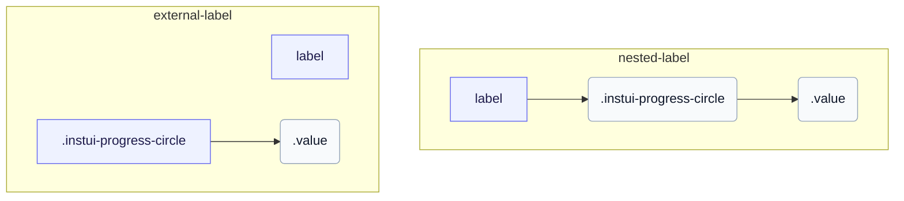

# CSS: progress-circle

`.instui-progress-circle` · <span class="instui-pill -color-success pantoken-doc-tag">stable</span> — A circular progress ring driven by `--value` and `--value-max` custom properties.

The ring is a `conic-gradient` donut painted on `::before` and clipped with a radial-gradient mask; `--value` divided by `--value-max` drives the arc. Add `-should-animate` and load the interactions entry point to animate it from zero on mount. InstUI has no indeterminate state; `:indeterminate` is a pantoken-only best guess (native `&lt;progress&gt;` without a `value` attribute), spinning the ring at a fixed arc and hiding `.value` since there's no meaningful number to show. `&lt;meter&gt;` has no indeterminate state, so it's unaffected.

**Source:** [progress-circle.css](https://github.com/thedannywahl/pantoken/blob/main/formats/components/src/components/progress-circle/progress-circle.css)

<!-- js-requirement -->
> [!TIP]
> **Izboljšava JS** — This component's CSS renders and works on its own; pair it with `@pantoken/interactions` to add the interactive behavior. Its `-should-animate` modifier is driven by that behavior. See the [modifier table below](#modifiers).


## Dostopnost

Use native `&lt;progress&gt;` for a zero-based task completion range and `&lt;meter&gt;` when the minimum is non-zero. Give either element an accessible name by nesting it in `&lt;label&gt;` or associating a separate `&lt;label&gt;` through matching `for` and `id` values.

## Uporaba

```css
@import "@pantoken/components/components.css";
@import "@pantoken/components/progress-circle.css";
```

## Primeri

### Nested label
```html
<label>
  Uploading Document: <progress class="instui-progress-circle -size-sm" value="70">70%</progress>
</label>
```
### External label
```html
<label for="score">Score</label>
<meter id="score" class="instui-progress-circle -color-success" min="20" value="40" max="60">50%</meter>
```

## Struktura

`// Variant: nested-label`

```text
label
  .instui-progress-circle
    .value
```

`// Variant: external-label`

```text
label
.instui-progress-circle
  .value
```



## Spremenljivke (modifikatorji)

| Modifikator | Opis |
| --- | --- |
| `.-color-brand` | Brand meter colour. |
| `.-color-danger` | Danger meter colour. |
| `.-color-info` | Informational meter colour. |
| `.-color-primary-inverse` | On-dark (primary inverse) meter colour. |
| `.-color-success` | Success meter colour. |
| `.-color-warning` | Warning meter colour. |
| `.-meter-color-alert` | <span class="instui-pill -color-danger pantoken-doc-tag">Zastarelo</span> — use `.-color-warning`. |
| `.-meter-color-brand` | <span class="instui-pill -color-danger pantoken-doc-tag">Zastarelo</span> — use `.-color-brand`. |
| `.-meter-color-danger` | <span class="instui-pill -color-danger pantoken-doc-tag">Zastarelo</span> — use `.-color-danger`. |
| `.-meter-color-info` | <span class="instui-pill -color-danger pantoken-doc-tag">Zastarelo</span> — use `.-color-info`. |
| `.-meter-color-success` | <span class="instui-pill -color-danger pantoken-doc-tag">Zastarelo</span> — use `.-color-success`. |
| `.-meter-color-warning` | <span class="instui-pill -color-danger pantoken-doc-tag">Zastarelo</span> — use `.-color-warning`. |
| `.-shold-animate-on-mount` | <span class="instui-pill -color-info pantoken-doc-tag">Alias</span> — maps to `.-should-animate`. |
| `.-should-animate` | <span class="instui-pill pantoken-doc-tag pantoken-doc-tag-interaction">Interaction</span> — Animate the meter, ring, and centered value into place on mount. |
| `.-should-animate-on-mount` | <span class="instui-pill -color-info pantoken-doc-tag">Alias</span> — maps to `.-should-animate`. |
| `.-size-large` | Large. Long-form alias of `-size-lg`. |
| `.-size-lg` | Large. |
| `.-size-md` | Medium (default). |
| `.-size-medium` | Medium (default). Long-form alias of `-size-md`. |
| `.-size-sm` | Small. |
| `.-size-small` | Small. Long-form alias of `-size-sm`. |
| `.-size-x-small` | Extra small. Long-form alias of `-size-xs`. |
| `.-size-xs` | Extra small. |

## Delii

| Del | Opis |
| --- | --- |
| `.value` | The value text centred in the ring's hole. |

## Psevdo-elementi

| Psevdo-element | Opis |
| --- | --- |
| `:::indeterminate` | Custom, not part of InstUI. Applies only to a native `&lt;progress&gt;` missing its `value` attribute; spins `::before` at a fixed arc and hides `.value`. |
| `::before` | Draws the ring itself: a conic-gradient donut clipped with a radial mask, whose arc tracks the `--value` custom property. |

## Stanja

| Stanje | Opis |
| --- | --- |
| `:indeterminate` | — |

## Lastnosti po meri

| Lastnost | Tip | Privzeto | Opis |
| --- | --- | --- | --- |
| `--animation-delay` | `<number>` | — | Milliseconds to wait before starting the mount animation (default `0`). |
| `--max` | `<number>` | — | The maximum progress value (default `100`). |
| `--min` | `<number>` | — | The minimum meter value (default `0`). |
| `--pantoken-pc-fill` | `<color>` | — | The filled arc (meter) colour; the -color-* modifiers set it. |
| `--pantoken-pc-stroke` | `<length>` | — | The ring's stroke width; the -size-* modifiers set it. |
| `--pantoken-pc-track` | `<color>` | — | The unfilled track colour. |
| `--value` | `<number>` | — | The current progress value; registered with @property so it can transition. |
| `--value-max` | `<number>` | — | @alias {@link --max} The maximum progress value (default `100`). |
| `--value-now` | `<number>` | — | @alias Alias for `--value`. |

## Animacije

| Animacija | Opis |
| --- | --- |
| `pantoken-progress-circle-indeterminate` | — |

## Porabljeni žetoni

| Žeton | Tip | Vrednost |
| --- | --- | --- |
| `--instui-component-progress-circle-color` | `<color>` | `light-dark(#273540, #ffffff)` |
| `--instui-component-progress-circle-color-inverse` | `<color>` | `light-dark(#ffffff, #1C222B)` |
| `--instui-component-progress-circle-font-family` | `[ <font-family-name> \| <generic-font-family> ]#` | `Atkinson Hyperlegible Next, "Helvetica Neue", Helvetica, Arial, sans-serif` |
| `--instui-component-progress-circle-font-weight` | `<integer>` | `600` |
| `--instui-component-progress-circle-large-size` | `<length>` | `9em` |
| `--instui-component-progress-circle-large-stroke-width` | `<length>` | `0.875em` |
| `--instui-component-progress-circle-line-height` | `<percentage>` | `125%` |
| `--instui-component-progress-circle-medium-size` | `<length>` | `7em` |
| `--instui-component-progress-circle-medium-stroke-width` | `<length>` | `0.625em` |
| `--instui-component-progress-circle-meter-color-brand` | `<color>` | `light-dark(#1D354F, #EEF4FD)` |
| `--instui-component-progress-circle-meter-color-brand-inverse` | `<color>` | `light-dark(#ffffff, #6A7883)` |
| `--instui-component-progress-circle-meter-color-danger` | `<color>` | `#E62429` |
| `--instui-component-progress-circle-meter-color-danger-inverse` | `<color>` | `light-dark(#ffffff, #6A7883)` |
| `--instui-component-progress-circle-meter-color-info` | `<color>` | `#2B7ABC` |
| `--instui-component-progress-circle-meter-color-info-inverse` | `<color>` | `light-dark(#ffffff, #6A7883)` |
| `--instui-component-progress-circle-meter-color-success` | `<color>` | `#03893D` |
| `--instui-component-progress-circle-meter-color-success-inverse` | `<color>` | `light-dark(#ffffff, #6A7883)` |
| `--instui-component-progress-circle-meter-color-warning` | `<color>` | `#CF4A00` |
| `--instui-component-progress-circle-meter-color-warning-inverse` | `<color>` | `light-dark(#ffffff, #6A7883)` |
| `--instui-component-progress-circle-small-size` | `<length>` | `5em` |
| `--instui-component-progress-circle-small-stroke-width` | `<length>` | `0.5em` |
| `--instui-component-progress-circle-track-color` | `<color>` | `light-dark(#ffffff, #10141A)` |
| `--instui-component-progress-circle-track-color-inverse` | `<color>` | `#00000000` |
| `--instui-component-progress-circle-x-small-size` | `<length>` | `3em` |
| `--instui-component-progress-circle-x-small-stroke-width` | `<length>` | `0.2em` |

## Podpora brskalnika

- Registers the numeric progress properties with `@property` and paints with CSS `mask` and `conic-gradient`; where custom-property transitions are unsupported the ring still renders but won't animate.

## Sorodno

- [progress](/sl/api/css/progress.md) — The linear bar form of the same determinate progress.

