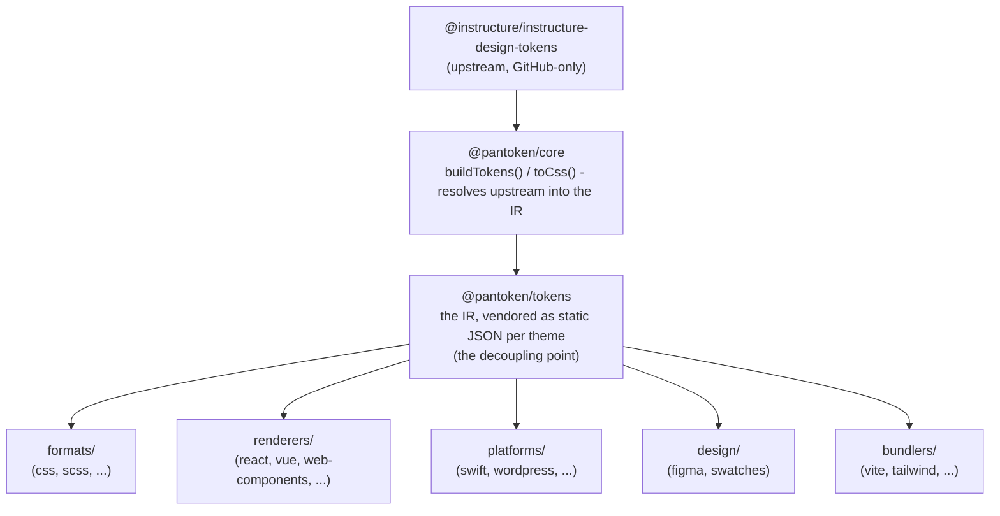

# Arhitektura

pantoken ima eno nalogo: enkrat razrešiti Instructure-ove oblikovne (design) tokene in ikone, nato pa to model
preoblikovati za vsak cilj. Spodnje plasti zagotavljajo poštenost te preoblikave in ohranjajo objavljene pakete brez
kakršnegakoli GitHub‑samo upstreama.

## Plasti

- **`@pantoken/model`** hrani tipne pogodbe (type contracts) in nič drugega. Je vir resnice za
  obliko `Token` in pogodbo za vtičnike, z ničelnimi odvisnostmi, zato se lahko nanj vsak paket
  prostovoljno opre.
- **`@pantoken/core`** je edini paket, ki se dotika upstream vira. Razreši tokene in
  ikone v canonical IR in upodobi CSS.
- **`@pantoken/tokens`** vključuje (vendors) ta IR kot statični JSON med gradnjo. To je točka razvezave:
  downstream paketi berejo `@pantoken/tokens`, nikoli `@pantoken/core`, zato `npm i pantoken` nikoli
  ne posega po GitHub‑samo upstreamu.
- **`@pantoken/utils`** nosi deljene pomočnike — `var(--x)` resolver, regexe za reference,
  pretvorbe velikosti črk in barv ter drift preverjanja, ki ohranjajo, da je generirana izhodna vsebina zvest IR.

## Zakaj so tokeni vendorirani

Upstream paket s tokeni živi na GitHubu, ne na npm. Če bi se vsak downstream paket nanj zanašal,
bi `npm i pantoken` odpovedal komurkoli brez tega dostopa. Namesto tega `@pantoken/tokens` razreši
upstream enkrat med gradnjo in zapiše rezultat v statični JSON. Objavljeni paketi nosijo ta
JSON, zato se namestijo čisto iz npm, pripnejo se na semver in delujejo brez povezave.

## Vedra

Vsako downstream vedro je način porabe IR:

- **formats/** — pretvori tokene v datoteko (CSS, SCSS, Less, Stylus, DTCG).
- **renderers/** — integracije ogrodij in orodij (React, Vue, Svelte, MUI, Pendo in več).
- **bundlers/** — vtičniki in prednastavitve gradnikov (Vite, Next, Tailwind, Panda, PostCSS, webpack).
- **platforms/** — cilji za native in site‑generatorje (Swift, Kotlin, Rust, WordPress, Drupal).
- **design/** — podatki za oblikovalska orodja (Figma, barvne vzorčne palete).
- **plugins/** — opcijski transformatorji, ki razširijo izhod tokenov ali CSS. Glej [Plugins](/guide/plugins).

## Generiran izhod

Vsak paket, ki izda datoteko, jo zapiše v za paket specifično `generated/` mapo, ki jo gradnja
reproducira, tako da se nič generiranega ne commita. Naloga delovnega prostora vse to preveri. Glej
[Generated output](/guide/generated-output).
