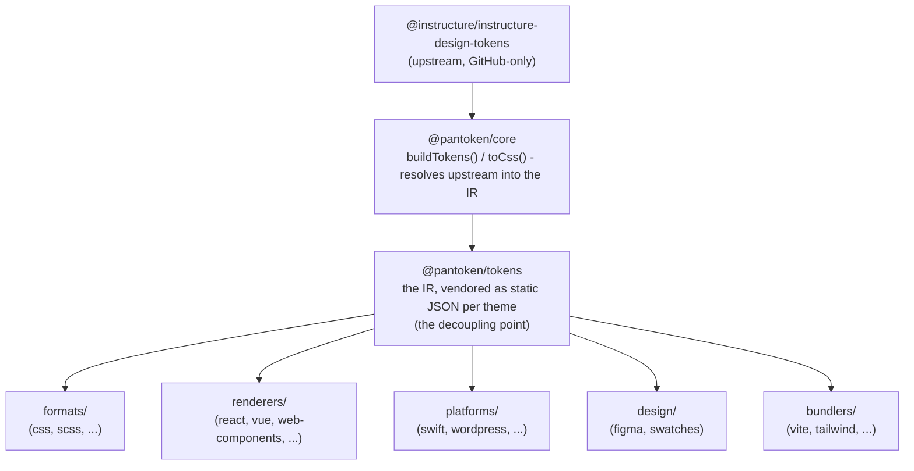

# Arkitektur

pantoken har ett uppdrag: lös upp Instructure:s designtokens och ikoner en gång, och omforma sedan den modellen
för varje mål. Lagren nedan håller den omformningen ärlig och håller de publicerade paketen fria
från någon GitHub-endast upstream.

## Lagren

- **`@pantoken/model`** innehåller typkontrakten, och inget annat. Det är sanningskällan för
  `Token`-formen och plugin-kontraktet, utan beroenden, så vilket paket som helst kan bero på det
  fritt.
- **`@pantoken/core`** är det enda paketet som rör upstream-källan. Det löser tokens och
  ikoner till den kanoniska IR:n och renderar CSS.
- **`@pantoken/tokens`** levererar den IR:n som statisk JSON vid build-tid. Detta är avkopplingspunkten:
  downstream-paket läser `@pantoken/tokens`, aldrig `@pantoken/core`, så `npm i pantoken` når aldrig
  efter den GitHub-endast upstreamen.
- **`@pantoken/utils`** bär de delade hjälparna — `var(--x)`-resolvern, referens-regexarna,
  versal-/gemen- och färgkonvertering, och driftkontrollerna som håller genererat output troget IR:n.

## Varför tokens vendoreras

Upstream-tokenpaketet ligger på GitHub, inte på npm. Om varje downstream-paket berodde på det,
skulle `npm i pantoken` misslyckas för vem som helst utan den åtkomsten. Istället löser `@pantoken/tokens`
upstreamen en gång vid build-tid och skriver resultatet till statisk JSON. De publicerade paketen bär den
JSON:en, så de installeras rent från npm, pinnas till semver och fungerar offline.

## Buckets

Varje downstream-bucket är ett sätt att konsumera IR:

- **formats/** — förvandla tokens till en fil (CSS, SCSS, Less, Stylus, DTCG).
- **renderers/** — ramverks- och verktygsintegrationer (React, Vue, Svelte, MUI, Pendo och fler).
- **bundlers/** — build-verktygs-plugins och presets (Vite, Next, Tailwind, Panda, PostCSS, webpack).
- **platforms/** — native- och site-generator-mål (Swift, Kotlin, Rust, WordPress, Drupal).
- **design/** — payloads för designverktyg (Figma, färgprover).
- **plugins/** — valfria transformationer som utökar token- eller CSS-output. Se [Plugins](/guide/plugins).

## Genererat output

Varje paket som skriver ut en fil skriver den till en per-paket `generated/`-katalog som en build
återskapar, så inget genererat är committat. Ett workspace-uppgift validerar allt detta. Se
[Generated output](/guide/generated-output).
