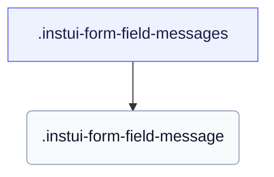

# CSS: form-field-messages

`.instui-form-field-messages` — Field help and validation messages — hint, error, success, and screen-reader-only — with a glyph on error and success.

Sets its own `gap` between stacked messages; chaining a `-gap-*` spacing utility modifier overrides that built-in value.

**Source:** [form-field-messages.css](https://github.com/thedannywahl/pantoken/blob/main/formats/components/src/components/form-field-messages/form-field-messages.css)

## การเข้าถึง

A `-type-screenreader-only` message is visually hidden but stays in the accessibility tree, so it's still announced; pair error and success messages with the field via aria-describedby so assistive tech reads them with the control.

## การใช้งาน

```css
@import "@pantoken/components/components.css";
@import "@pantoken/components/form-field-messages.css";
```

## ตัวอย่าง

```html
<div class="instui-form-field-messages">
  <span class="instui-form-field-message -type-hint">We'll never share it.</span>
  <span class="instui-form-field-message -type-error">Enter a valid email address.</span>
</div>
```

## โครงสร้าง

```text
.instui-form-field-messages
  .instui-form-field-message
```



## ตัวปรับแต่ง

| ตัวปรับแต่ง | คำอธิบาย |
| --- | --- |
| `.-type-new-error` | <span class="instui-pill -color-info pantoken-doc-tag">Alias</span> — maps to `.-type-error`. |

## ส่วนประกอบ

| ส่วน | คำอธิบาย |
| --- | --- |
| `.instui-form-field-message` | An individual message; its `-type-*` picks the hint, error, success, or screen-reader-only variant. |

## องค์ประกอบเทียม

| องค์ประกอบเทียม | คำอธิบาย |
| --- | --- |
| `::before` | Renders the leading status glyph on error and success messages: an alert circle for errors and a check circle for success. |

## โทเค็นที่ใช้

| โทเค็น | ชนิด | ค่า |
| --- | --- | --- |
| `--instui-component-form-field-layout-gap-primitives` | `<length>` | `0.5rem` |
| `--instui-component-form-field-message-error-text-color` | `<color>` | `light-dark(#CF1F24, #FA917F)` |
| `--instui-component-form-field-message-font-family` | `[ <font-family-name> \| <generic-font-family> ]#` | `Atkinson Hyperlegible Next, "Helvetica Neue", Helvetica, Arial, sans-serif` |
| `--instui-component-form-field-message-font-size` | `<length>` | `0.875rem` |
| `--instui-component-form-field-message-font-weight` | `<integer>` | `400` |
| `--instui-component-form-field-message-hint-text-color` | `<color>` | `light-dark(#273540, #ffffff)` |
| `--instui-component-form-field-message-line-height` | `<length>` | `1.25rem` |
| `--instui-component-form-field-message-success-text-color` | `<color>` | `light-dark(#037D37, #61C378)` |
| `--instui-icon-circle-alert` | `<image>` | `url('data:image/svg+xml;utf8,%3Csvg%20xmlns%3D%22http%3A%2F%2Fwww.w3.org%2F2000%2Fsvg%22%20width%3D%2224%22%20height%3D%2224%22%20viewBox%3D%220%200%2024%2024%22%20fill%3D%22none%22%20stroke%3D%22currentColor%22%20stroke-width%3D%222%22%20stroke-linecap%3D%22round%22%20stroke-linejoin%3D%22round%22%3E%3Ccircle%20cx%3D%2212%22%20cy%3D%2212%22%20r%3D%2210%22%2F%3E%3Cline%20x1%3D%2212%22%20x2%3D%2212%22%20y1%3D%228%22%20y2%3D%2212%22%2F%3E%3Cline%20x1%3D%2212%22%20x2%3D%2212.01%22%20y1%3D%2216%22%20y2%3D%2216%22%2F%3E%3C%2Fsvg%3E')` |
| `--instui-icon-circle-check` | `<image>` | `url('data:image/svg+xml;utf8,%3Csvg%20xmlns%3D%22http%3A%2F%2Fwww.w3.org%2F2000%2Fsvg%22%20width%3D%2224%22%20height%3D%2224%22%20viewBox%3D%220%200%2024%2024%22%20fill%3D%22none%22%20stroke%3D%22currentColor%22%20stroke-width%3D%222%22%20stroke-linecap%3D%22round%22%20stroke-linejoin%3D%22round%22%3E%3Ccircle%20cx%3D%2212%22%20cy%3D%2212%22%20r%3D%2210%22%2F%3E%3Cpath%20d%3D%22m9%2012%202%202%204-4%22%2F%3E%3C%2Fsvg%3E')` |

## ที่เกี่ยวข้อง

- [form-field](/th/api/css/form-field.md) — Wraps a label, controls, and these messages.

