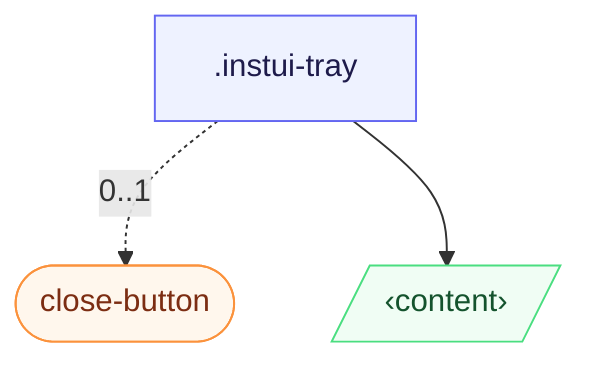

# CSS: tray

`.instui-tray` — An edge-pinned panel that slides in from any side; a native `[popover]` or `&lt;dialog&gt;`.

Start/end placements resolve against `inset-inline` (logical, direction-aware); the slide-in transform mirrors automatically under an ancestor `[dir="rtl"]`, so no extra markup is needed for right-to-left layouts.

**Source:** [tray.css](https://github.com/thedannywahl/pantoken/blob/main/formats/components/src/components/tray/tray.css)

## การเข้าถึง

The tray is a dialog or popover surface, so name it with `aria-label` or `aria-labelledby`, and its close control carries an `aria-label` (the `.instui-close-button` in the example uses `aria-label="Close"`).

## การใช้งาน

```css
@import "@pantoken/components/components.css";
@import "@pantoken/components/tray.css";
```

## ตัวอย่าง

```html
<div class="instui-tray -placement-end -size-sm">
  <span class="instui-heading -level-h3">Filters</span>
  <p class="-size-sm">A tray slides in from the start edge and fills the viewport height.</p>
</div>
<button class="instui-button -toggle">toggle tray</button>
```

## โครงสร้าง

```text
.instui-tray
  close-button (component, 0..1)
  ‹content›
```



## ตัวปรับแต่ง

| ตัวปรับแต่ง | คำอธิบาย |
| --- | --- |
| `.-placement-bottom` | Pin to the bottom edge. |
| `.-placement-end` | Pin to the end (inline-end) edge. |
| `.-placement-start` | (default) Pin to the start (inline-start) edge. |
| `.-placement-top` | Pin to the top edge. |
| `.-size-large` | Large. Long-form alias of `-size-lg`. |
| `.-size-lg` | Large. |
| `.-size-md` | (default) Medium. |
| `.-size-medium` | (default) Medium. Long-form alias of `-size-md`. |
| `.-size-regular` | <span class="instui-pill -color-danger pantoken-doc-tag">เลิกใช้</span> — use `.-size-md`. |
| `.-size-sm` | Small. |
| `.-size-small` | Small. Long-form alias of `-size-sm`. |
| `.-size-x-large` | Extra large. Long-form alias of `-size-xl`. |
| `.-size-x-small` | Extra small. Long-form alias of `-size-xs`. |
| `.-size-xl` | Extra large. |
| `.-size-xs` | Extra small. |

## เงื่อนไข

| ชนิด | การค้นหา | คำอธิบาย |
| --- | --- | --- |
| supports | `(transition-behavior: allow-discrete)` | — |

## โทเค็นที่ใช้

| โทเค็น | ชนิด | ค่า |
| --- | --- | --- |
| `--instui-component-tray-background-color` | `<color>` | `light-dark(#ffffff, #1C222B)` |
| `--instui-component-tray-border-color` | `<color>` | `light-dark(#E8EAEC, #334450)` |
| `--instui-component-tray-border-width` | `<length>` | `0.0625rem` |
| `--instui-component-tray-padding` | `<length>` | `1.5rem` |
| `--instui-component-tray-width-lg` | `<length>` | `48em` |
| `--instui-component-tray-width-md` | `<length>` | `30em` |
| `--instui-component-tray-width-sm` | `<length>` | `20em` |
| `--instui-component-tray-width-xl` | `<length>` | `62em` |
| `--instui-component-tray-width-xs` | `<length>` | `16em` |
| `--instui-component-tray-z-index` | `<integer>` | `9999` |
| `--instui-elevation-topmost` | `none \| <shadow>#` | — |
| `--tray-slide-x` | — | `-100%` |
| `--tray-slide-y` | — | `0%` |

## รองรับเบราว์เซอร์

- Opens with the native `[popover]` API and `@starting-style`; the slide-in sits behind an `@supports (transition-behavior: allow-discrete)` guard, so browsers without it still open the tray, just without the slide.

## ส่วนประกอบย่อย

- [close-button](/th/api/css/close-button.md)

## ที่เกี่ยวข้อง

- [modal](/th/api/css/modal.md) — The same dismissible overlay pattern, centred instead of edge-pinned.
- [popover](/th/api/css/popover.md) — The generic top-layer surface this builds on.

