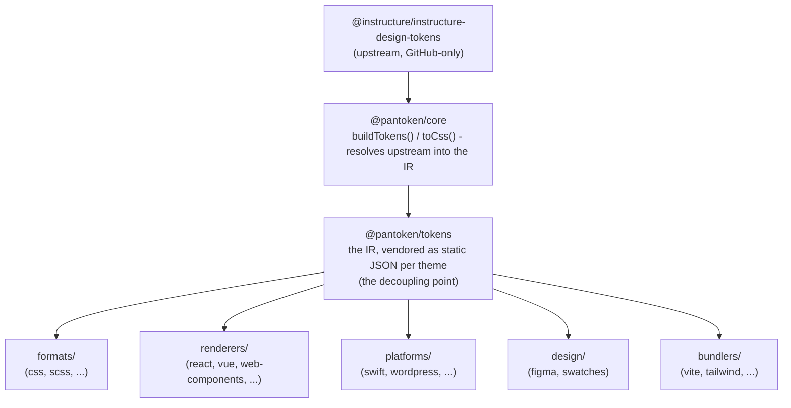

# สถาปัตยกรรม

pantoken มีหน้าที่เดียว: แปลงโทเค็นการออกแบบและไอคอนของ Instructure หนึ่งครั้ง แล้วปรับรูปแบบโมเดลนั้น
ให้เหมาะกับแต่ละเป้าหมาย ชั้นด้านล่างช่วยให้การปรับรูปแบบนั้นถูกต้องและรักษาให้แพ็กเกจที่เผยแพร่ปราศจาก
ขึ้นต้นทางที่เข้าถึงได้เฉพาะบน GitHub

## ชั้นต่างๆ

- **`@pantoken/model`** จัดเก็บสัญญาประเภท (type contracts) เท่านั้น และไม่มีอย่างอื่น มันเป็นแหล่งความจริงสำหรับ
  รูปร่างของ `Token` และสัญญาของปลั๊กอิน โดยไม่มีการพึ่งพาใด ๆ จึงทำให้แพ็กเกจใด ๆ สามารถพึ่งพามันได้
  อย่างเสรี
- **`@pantoken/core`** เป็นแพ็กเกจเดียวที่สัมผัสกับแหล่งข้อมูลต้นทาง มันแก้ไขโทเค็นและ
  ไอคอนเป็น IR แบบ canonical และเรนเดอร์เป็น CSS
- **`@pantoken/tokens`** จัดเตรียม IR นั้นเป็น JSON คงที่ในเวลาสร้าง นี่คือจุดแยกการถอดคู่:
  แพ็กเกจปลายน้ำอ่าน `@pantoken/tokens` ไม่ใช่ `@pantoken/core` ดังนั้น `npm i pantoken` จะไม่เคย
  เข้าถึงแหล่งที่มาที่มีเฉพาะบน GitHub
- **`@pantoken/utils`** ถือฮีลเปอร์ที่ใช้ร่วม — ตัวแก้ไข `var(--x)` , regex อ้างอิง,
  การแปลงตัวพิมพ์และสี และการตรวจสอบ drift ที่ทำให้เอาต์พุตที่สร้างขึ้นซื่อสัตย์ต่อ IR

## เหตุผลที่โทเค็นถูกเวนเดอร์

แพ็กเกจโทเค็นต้นทางอยู่บน GitHub ไม่ใช่ npm หากแพ็กเกจปลายน้ำทุกตัวพึ่งพามัน,
`npm i pantoken` จะล้มเหลวสำหรับผู้ใดก็ตามที่ไม่มีการเข้าถึงนั้น แทนที่จะเป็นเช่นนั้น `@pantoken/tokens` แก้ไข
ต้นทางเพียงครั้งเดียวในเวลาสร้างและเขียนผลลัพธ์เป็น JSON คงที่ แพ็กเกจที่เผยแพร่จึงพก
JSON นั้นไปด้วย ทำให้ติดตั้งได้สะอาดจาก npm ยึดตาม semver และทำงานแบบออฟไลน์ได้

## บัคเก็ต

แต่ละบัคเก็ตปลายน้ำเป็นวิธีการบริโภค IR:

- **formats/** — เปลี่ยนโทเค็นเป็นไฟล์ (CSS, SCSS, Less, Stylus, DTCG)
- **renderers/** — การรวมกับเฟรมเวิร์กและเครื่องมือ (React, Vue, Svelte, MUI, Pendo, และอื่น ๆ)
- **bundlers/** — ปลั๊กอินและพรีเซ็ตของเครื่องมือสร้าง (Vite, Next, Tailwind, Panda, PostCSS, webpack)
- **platforms/** — เป้าหมาย native และตัวสร้างไซต์ (Swift, Kotlin, Rust, WordPress, Drupal)
- **design/** — เพย์โหลดสำหรับเครื่องมือออกแบบ (Figma, color swatches)
- **plugins/** — การแปลงทางเลือกที่ขยายผลลัพธ์โทเค็นหรือ CSS ดู [Plugins](/guide/plugins)

## ผลลัพธ์ที่สร้างขึ้น

ทุกแพ็กเกจที่สร้างไฟล์จะเขียนไฟล์ไปยังไดเรกทอรี `generated/` ต่อแพ็กเกจที่กระบวนการสร้าง
ทำซ้ำได้ ดังนั้นสิ่งที่สร้างขึ้นจะไม่ถูกคอมมิต งานของ workspace จะตรวจสอบความถูกต้องทั้งหมด ดู
[Generated output](/guide/generated-output)
