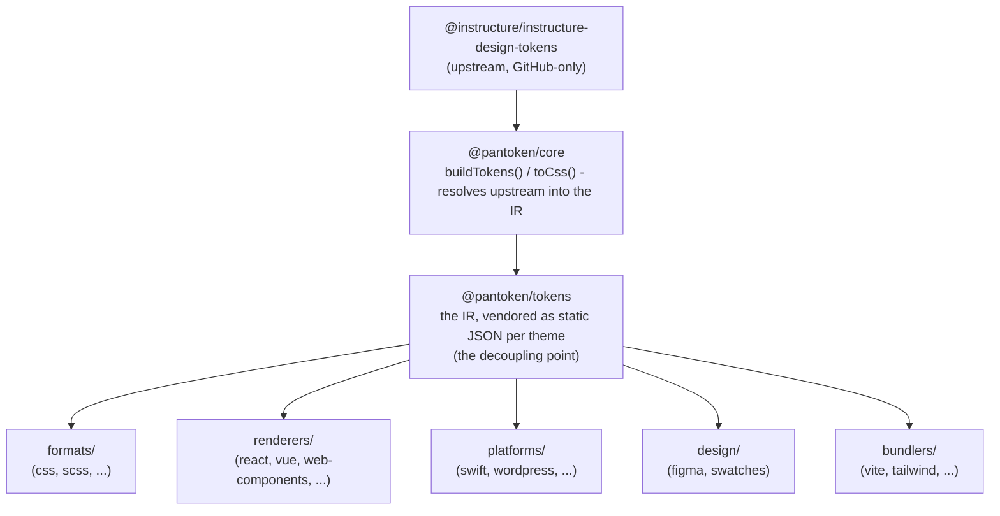

# Mimari

pantoken'in bir görevi var: Instructure'ın tasarım token'larını ve ikonlarını bir kez çözmek ve sonra bu modeli
her hedef için yeniden şekillendirmek. Aşağıdaki katmanlar bu yeniden şekillendirmeyi dürüst tutar ve yayımlanan paketlerin
herhangi bir yalnızca-GitHub üst akışına bağımlı olmasını engeller.

## Katmanlar

- **`@pantoken/model`** yalnızca tür sözleşmelerini tutar ve başka hiçbir şey yapmaz. Bu, `Token` biçiminin
  ve eklenti sözleşmesinin doğruluk kaynağıdır; sıfır bağımlılıkla herhangi bir paketin ona serbestçe bağımlı olmasını sağlar.
- **`@pantoken/core`** üst akış kaynağına dokunan tek pakettir. Token'ları ve
  ikonları kanonik IR'ye çözer ve CSS'i render eder.
- **`@pantoken/tokens`** bu IR'yi derleme zamanında statik JSON olarak paketler. Bu ayrılma noktasıdır:
  aşağı akış paketleri `@pantoken/tokens`'ü okur, asla `@pantoken/core`'i değil, böylece `npm i pantoken`
  asla yalnızca-GitHub üst akışına uzanmaz.
- **`@pantoken/utils`** paylaşılan yardımcıları taşır — `var(--x)` çözücüsü, referans regex'leri,
  büyük/küçük harf ve renk dönüşümleri ve üretilen çıktıyı IR'ye sadık tutan sapma kontrolleri.

## Neden token'lar paketleniyor

Üst akış token paketi GitHub'da yaşıyor, npm'de değil. Eğer her aşağı akış paket buna bağımlı olsaydı,
`npm i pantoken` erişimi olmayan herkes için başarısız olurdu. Bunun yerine `@pantoken/tokens` üst
akışı bir kere derleme zamanında çözer ve sonucu statik JSON'a yazar. Yayımlanan paketler bu
JSON'u taşır, böylece npm'den temiz kurulurlar, semver'e sabitlenirler ve çevrimdışı çalışırlar.

## Bölümler

Her aşağı akış bölüm IR'yi tüketmenin bir yoludur:

- **formats/** — token'ları bir dosyaya dönüştürür (CSS, SCSS, Less, Stylus, DTCG).
- **renderers/** — framework ve araç entegrasyonları (React, Vue, Svelte, MUI, Pendo ve daha fazlası).
- **bundlers/** — build-aracı eklentileri ve ön ayarları (Vite, Next, Tailwind, Panda, PostCSS, webpack).
- **platforms/** — yerel ve site üretici hedefleri (Swift, Kotlin, Rust, WordPress, Drupal).
- **design/** — tasarım araçları için payload'lar (Figma, renk örnekleri).
- **plugins/** — token veya CSS çıktısını genişleten opsiyonel dönüşümler. Bakınız [Plugins](/guide/plugins).

## Üretilen çıktı

Bir dosya üreten her paket, derlemenin yeniden ürettiği paket başına bir `generated/` dizinine yazar, bu yüzden üretilen hiçbir şey commit edilmez. Bir workspace görevi bunların tümünü doğrular. Bakınız
[Generated output](/guide/generated-output).
