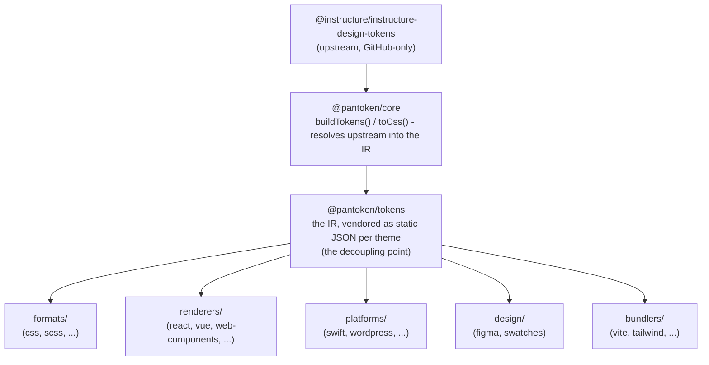

# Архітектура

pantoken має одну задачу: один раз вирішити (resolve) дизайн-токени та іконки Instructure, а потім перетворити цю модель
для кожної цільової платформи. Шари нижче забезпечують коректність цього перетворення та утримують опубліковані пакети вільними
від будь-якого GitHub-специфічного upstream.

## Шари

- **`@pantoken/model`** містить контракти типів і нічого більше. Це джерело істини для форми
  `Token` та контракту плагіна, без залежностей, тому будь-який пакет може залежати від нього
  вільно.
- **`@pantoken/core`** — єдиний пакет, який торкається upstream-джерела. Він перетворює токени та
  іконки в канонічний IR і рендерить CSS.
- **`@pantoken/tokens`** постачає цей IR як статичний JSON під час збірки. Це точка відвʼязки:
  downstream-пакети читають `@pantoken/tokens`, а не `@pantoken/core`, тож `npm i pantoken` ніколи не
  звертається до GitHub-специфічного upstream.
- **`@pantoken/utils`** несе спільні допоміжні засоби — резолвер `var(--x)`, регулярні вирази для посилань,
  перетворення регістру та кольору, а також перевірки дрейфу, які забезпечують відповідність згенерованого виводу IR.

## Чому токени вендоряться

Upstream-пакет токенів живе на GitHub, а не в npm. Якби кожний downstream-пакет залежав від нього,
`npm i pantoken` зазнавав би збою у будь-кого без доступу. Натомість `@pantoken/tokens` розв’язує
upstream один раз під час збірки і записує результат у статичний JSON. Опубліковані пакети несуть цей
JSON, тож вони встановлюються чисто з npm, привʼязані до semver і працюють офлайн.

## Бакети

Кожен downstream-бакет — це спосіб споживання IR:

- **formats/** — перетворює токени в файл (CSS, SCSS, Less, Stylus, DTCG).
- **renderers/** — інтеграції з фреймворками та інструментами (React, Vue, Svelte, MUI, Pendo та інші).
- **bundlers/** — плагіни та пресети для збірників (Vite, Next, Tailwind, Panda, PostCSS, webpack).
- **platforms/** — нативні цілі та сайто-конструктори (Swift, Kotlin, Rust, WordPress, Drupal).
- **design/** — payload-и для дизайнерських інструментів (Figma, палітри кольорів).
- **plugins/** — опціональні трансформації, що розширюють токен- або CSS-вивід. Див. [Plugins](/guide/plugins).

## Згенерований вивід

Кожен пакет, що емить файл, записує його в per-package директорію `generated/`, яку відтворює збірка,
тому нічого згенерованого не комитується. Робоче завдання валідує все це. Див.
[Generated output](/guide/generated-output).
