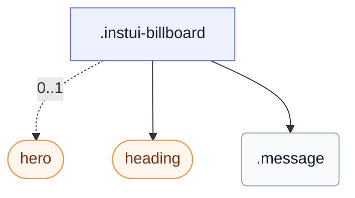

# CSS: billboard

`.instui-billboard` — A large empty-state or call-to-action block: a hero icon or image, a heading, and a message.

The `.hero`/`.heading`/`.message` parts are composed by the consumer's markup, not enforced structure; `-clickable` only adds hover styling, so a real click target still needs `tabindex` and a keyboard handler.

**Source:** [billboard.css](https://github.com/thedannywahl/pantoken/blob/main/formats/components/src/components/billboard/billboard.css)

## Sử dụng

```css
@import "@pantoken/components/components.css";
@import "@pantoken/components/billboard.css";
```

## Các ví dụ

```html
<div class="instui-billboard -size-md -clickable" tabindex="0">
  <span class="hero -icon-inbox"></span>
  <div class="heading">No items yet</div>
  <div class="message">Create your first item to get started.</div>
</div>
```

## Cấu trúc

```text
.instui-billboard
  hero (component, 0..1)
  heading (component)
  .message
```



## Bộ sửa

| Bộ sửa | Mô tả |
| --- | --- |
| `.-clickable` | Interactive (clickable) styling with hover feedback. |
| `.-icon-*` | Render a leading icon glyph on `.hero` (e.g. `<span class="hero -icon-inbox"></span>`). |
| `.-size-large` | Long-form alias of {@link -size-lg}. |
| `.-size-lg` | Large: roomier spacing with larger heading, message, and hero icon. |
| `.-size-md` | Medium (default): standard spacing with medium heading, message, and hero icon. |
| `.-size-medium` | Long-form alias of {@link -size-md}. |
| `.-size-sm` | Small: tighter spacing with smaller heading, message, and hero icon. |
| `.-size-small` | Long-form alias of {@link -size-sm}. |

## Phần

| Phần | Mô tả |
| --- | --- |
| `.heading` | The billboard heading. |
| `.hero` | The optional leading icon or image. |
| `.message` | The supporting message. |

## Token tiêu thụ

| Token | Kiểu | Giá trị |
| --- | --- | --- |
| `--instui-color-text-base` | `<color>` | `light-dark(#273540, #F2F4F5)` |
| `--instui-component-billboard-background-color` | `<color>` | `#00000000` |
| `--instui-component-billboard-button-border-radius` | `<length>` | `0.5rem` |
| `--instui-component-billboard-button-border-style` | — | `solid` |
| `--instui-component-billboard-button-border-width` | `<length>` | `0.125rem` |
| `--instui-component-billboard-clickable-active-bg` | `<color>` | `light-dark(#44709F, #2E5177)` |
| `--instui-component-billboard-font-family` | `[ <font-family-name> \| <generic-font-family> ]#` | `Atkinson Hyperlegible Next, "Helvetica Neue", Helvetica, Arial, sans-serif` |
| `--instui-component-billboard-large-margin` | `<length>` | `1.5rem` |
| `--instui-component-billboard-medium-margin` | `<length>` | `0.75rem` |
| `--instui-component-billboard-padding-large` | `<length>` | `1.5rem` |
| `--instui-component-billboard-padding-medium` | `<length>` | `1.5rem` |
| `--instui-component-billboard-padding-small` | `<length>` | `0.75rem` |
| `--instui-component-icon-illu-lg` | `<length>` | `10rem` |
| `--instui-component-icon-illu-md` | `<length>` | `5rem` |
| `--instui-component-icon-illu-sm` | `<length>` | `3rem` |
| `--instui-component-link-on-color-text-color` | `<color>` | `#ffffff` |
| `--instui-component-link-text-color` | `<color>` | `light-dark(#2369A4, #7FB4F1)` |
| `--instui-component-text-font-size-x-x-large` | `<length>` | `2.375rem` |
| `--instui-focus-outline-color` | `auto \| <color>` | — |
| `--instui-focus-outline-offset` | `<length>` | — |
| `--instui-focus-outline-style` | `auto \| <outline-line-style>` | — |
| `--instui-focus-outline-width` | `<line-width>` | — |
| `--instui-font-size-text-base` | `<length>` | `1rem` |
| `--instui-font-size-text-sm` | `<length>` | `0.875rem` |
| `--instui-spacing-space-sm` | `<length>` | `0.5rem` |
| `--instui-spacing-space-xs` | `<length>` | `0.25rem` |

## Hỗ trợ trình duyệt

- Contains its element styles with the CSS `@scope` at-rule; needs a recent Chromium, Firefox, or Safari.

## Các thành phần phụ

- [heading](/vi/api/css/heading.md)
- [hero](/vi/api/css/hero.md)

