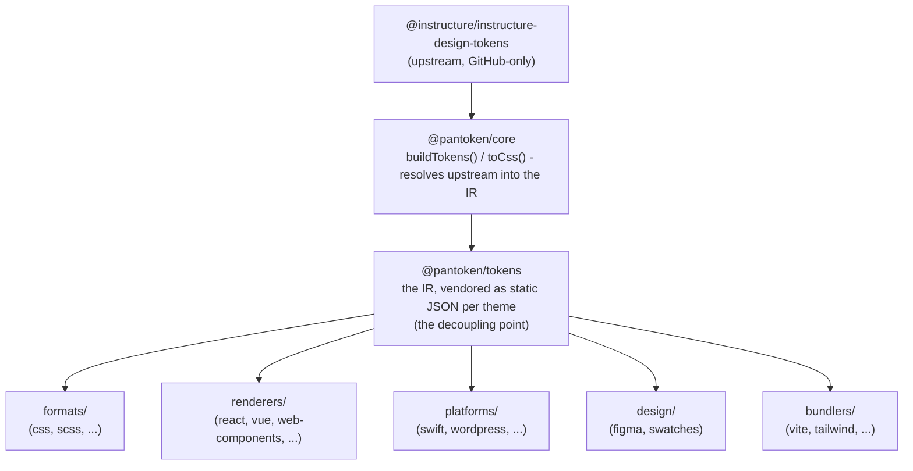

# Kiến trúc

pantoken có một nhiệm vụ: giải quyết các design token và icon của Instructure một lần, rồi định hình lại mô hình đó cho mọi đích. Các lớp bên dưới giữ cho việc định hình lại đó minh bạch và giữ cho các package được phát hành không phụ thuộc vào upstream chỉ có trên GitHub.

## Các lớp

- **`@pantoken/model`** giữ các hợp đồng kiểu (type contracts), và không có gì khác. Nó là nguồn dữ liệu chính cho
  hình dạng `Token` và hợp đồng plugin, với không phụ thuộc nào, nên bất kỳ package nào cũng có thể phụ thuộc vào nó
  một cách tự do.
- **`@pantoken/core`** là package duy nhất chạm tới nguồn upstream. Nó giải quyết tokens và
  icons thành IR chuẩn và xuất CSS.
- **`@pantoken/tokens`** cung cấp IR đó như JSON tĩnh tại thời điểm build. Đây là điểm tách rời:
  các package hạ nguồn đọc `@pantoken/tokens`, không bao giờ `@pantoken/core`, nên `npm i pantoken` không bao giờ
  cần truy cập upstream chỉ có trên GitHub.
- **`@pantoken/utils`** chứa các helper chia sẻ — bộ giải `var(--x)`, các regex tham chiếu,
  chuyển đổi chữ hoa/chữ thường và màu sắc, cùng các kiểm tra drift giữ cho đầu ra sinh ra trung thực với IR.

## Tại sao tokens được vendor hóa

Package token upstream nằm trên GitHub, không trên npm. Nếu mọi package hạ nguồn phụ thuộc vào nó,
`npm i pantoken` sẽ thất bại đối với bất kỳ ai không có quyền truy cập đó. Thay vào đó `@pantoken/tokens` giải quyết
upstream một lần ở thời điểm build và ghi kết quả ra JSON tĩnh. Các package được phát hành mang theo
JSON đó, nên chúng cài đặt sạch từ npm, ghim theo semver, và hoạt động ngoại tuyến.

## Buckets

Mỗi bucket hạ nguồn là một cách tiêu thụ IR:

- **formats/** — chuyển tokens thành một file (CSS, SCSS, Less, Stylus, DTCG).
- **renderers/** — tích hợp framework và công cụ (React, Vue, Svelte, MUI, Pendo, và nhiều hơn nữa).
- **bundlers/** — plugin và preset cho công cụ build (Vite, Next, Tailwind, Panda, PostCSS, webpack).
- **platforms/** — đích native và trình tạo trang (Swift, Kotlin, Rust, WordPress, Drupal).
- **design/** — payload cho công cụ thiết kế (Figma, bảng màu).
- **plugins/** — các transform tùy chọn mở rộng token hoặc đầu ra CSS. Xem [Plugins](/guide/plugins).

## Đầu ra sinh ra

Mỗi package phát sinh file ghi nó vào thư mục `generated/` theo từng package mà một build
tái tạo, nên không có gì sinh ra được commit. Một tác vụ workspace xác thực tất cả. Xem
[Generated output](/guide/generated-output).
