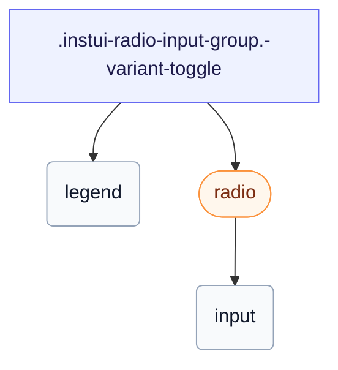

# CSS: radio-input-group

`.instui-radio-input-group` — A single-select radio `&lt;fieldset&gt;`, plain or as a connected segmented toggle.

Sets its own `gap` between radios; chaining a `-gap-*` spacing utility modifier overrides that built-in value.

**Source:** [radio-input-group.css](https://github.com/thedannywahl/pantoken/blob/main/formats/components/src/components/radio-input-group/radio-input-group.css)

## 无障碍

Renders a native `&lt;fieldset&gt;` with a `&lt;legend&gt;` that names the group; the child radios share one `name`, so only one can be selected at a time.

## 用法

```css
@import "@pantoken/components/components.css";
@import "@pantoken/components/radio-input-group.css";
```

## 示例

```html
<fieldset class="instui-radio-input-group">
  <legend>T-shirt size</legend>
  <label class="instui-radio"><input type="radio" name="size" checked> Small</label>
  <label class="instui-radio"><input type="radio" name="size"> Medium</label>
  <label class="instui-radio"><input type="radio" name="size"> Large</label>
</fieldset>
```
### Toggle variant
```html
<fieldset class="instui-radio-input-group -variant-toggle">
  <legend>T-shirt size</legend>
  <label class="instui-radio -variant-toggle"><input type="radio" name="size" checked> Small</label>
  <label class="instui-radio -variant-toggle"><input type="radio" name="size"> Medium</label>
  <label class="instui-radio -variant-toggle"><input type="radio" name="size"> Large</label>
</fieldset>
```

## 结构

```text
.instui-radio-input-group.-variant-toggle
  legend
  radio (component)
    input
```



## 修饰符

| 修饰符 | 描述 |
| --- | --- |
| `.-layout-columns` | Lay the radios out in columns. |
| `.-layout-inline` | Lay the radios out inline. |
| `.-required` | Mark the group as required. |
| `.-variant-toggle` | Lay the child toggles out as a segmented control (only the selected segment fills). |

## 伪元素

| 伪元素 | 描述 |
| --- | --- |
| `::after` | Renders the decorative required-field asterisk after the legend text when the group is required. |

## 消耗代币

| 代币 | 类型 | 值 |
| --- | --- | --- |
| `--instui-component-form-field-layout-asterisk-color` | `<color>` | `light-dark(#CF1F24, #FA917F)` |
| `--instui-component-form-field-layout-font-family` | `[ <font-family-name> \| <generic-font-family> ]#` | `Atkinson Hyperlegible Next, "Helvetica Neue", Helvetica, Arial, sans-serif` |
| `--instui-component-form-field-layout-font-size` | `<length>` | `1rem` |
| `--instui-component-form-field-layout-font-weight` | `<integer>` | `400` |
| `--instui-component-form-field-layout-gap-inputs` | `<length>` | `0.75rem` |
| `--instui-component-form-field-layout-gap-primitives` | `<length>` | `0.5rem` |
| `--instui-component-form-field-layout-line-height` | `<length>` | `1.125rem` |
| `--instui-component-form-field-layout-text-color` | `<color>` | `light-dark(#273540, #ffffff)` |
| `--instui-spacing-space-md` | `<length>` | `0.75rem` |

## 子组件

- [radio](/zh-Hans/api/css/radio.md)

## 相关

- [radio](/zh-Hans/api/css/radio.md) — The individual control this group collects.
- [form-field-group](/zh-Hans/api/css/form-field-group.md) — The general wrapper for grouping and laying out fields.

