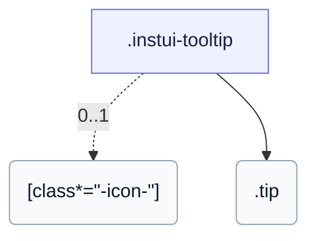

# CSS: tooltip

`.instui-tooltip` — A CSS hover and focus tooltip bubble, positionable on any side.

Toggling is pure CSS (`:hover`/`:focus-within`), so the bubble only reaches keyboard users through a focusable trigger; unlike `popover`, it isn't dismissible or click-triggered.

**Source:** [tooltip.css](https://github.com/thedannywahl/pantoken/blob/main/formats/components/src/components/tooltip/tooltip.css)

<!-- js-requirement -->
> [!TIP]
> **JS 增强** — This component's CSS renders and works on its own; pair it with `@pantoken/interactions` to add the interactive behavior. See the [modifier table below](#modifiers).


## 无障碍

Point the trigger at the bubble with aria-describedby and give the bubble role="tooltip".

## 用法

```css
@import "@pantoken/components/components.css";
@import "@pantoken/components/tooltip.css";
```

## 示例

```html
<span class="instui-tooltip" aria-describedby="tt-1">
  <span class="instui-icon -icon-info"></span>
  <span class="tip" id="tt-1" role="tooltip">Default placement is top</span>
</span>
```

## 结构

```text
.instui-tooltip
  [class*="-icon-"] (0..1)
  .tip
```



## 修饰符

| 修饰符 | 描述 |
| --- | --- |
| `.-icon-*` | Render a trigger glyph icon next to the tooltip bubble. |

## 部件

| 部件 | 描述 |
| --- | --- |
| `.tip` | The bubble; `-placement-*` sets its side. |

## 消耗代币

| 代币 | 类型 | 值 |
| --- | --- | --- |
| `--instui-border-radius-sm` | `<length>` | `0.25rem` |
| `--instui-color-background-inverse` | `<color>` | `light-dark(#334450, #F2F4F5)` |
| `--instui-color-text-inverse` | `<color>` | `light-dark(#ffffff, #1C222B)` |
| `--instui-component-tooltip-font-family` | `[ <font-family-name> \| <generic-font-family> ]#` | `Atkinson Hyperlegible Next, "Helvetica Neue", Helvetica, Arial, sans-serif` |
| `--instui-component-tooltip-font-size` | `<length>` | `0.875rem` |
| `--instui-component-tooltip-font-weight` | `<integer>` | `400` |
| `--instui-component-tooltip-padding` | `<length>` | `0.75rem` |
| `--instui-spacing-space-xs` | `<length>` | `0.25rem` |

## 相关

- [popover](/zh-Hans/api/css/popover.md) — The larger, click-triggered anchored surface.
- [context-view](/zh-Hans/api/css/context-view.md) — A related anchored surface with a pointer.

