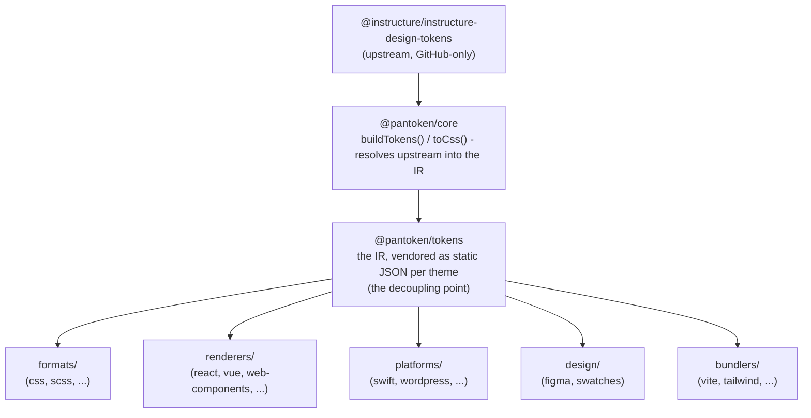

# 架构

pantoken 的一个职责：将 Instructure 的设计 token 和图标解析一次，然后为每个目标重塑该模型。下面的层次保持这种重塑的准确性，并确保发布的包不包含任何仅供 GitHub 使用的上游依赖。

## 层次

- **`@pantoken/model`** 保存类型契约，仅此而已。它是 `Token` 形状和插件契约的事实来源，且没有任何依赖，因此任何包都可以自由依赖它。
- **`@pantoken/core`** 是唯一接触上游源的包。它将 tokens 和图标解析为规范的中间表示（IR）并渲染 CSS。
- **`@pantoken/tokens`** 在构建时将该 IR 作为静态 JSON 提供。这是解耦点：下游包读取 `@pantoken/tokens`，而不是 `@pantoken/core`，因此 `npm i pantoken` 不会去访问仅限 GitHub 的上游。
- **`@pantoken/utils`** 承载共享的辅助工具 —— `var(--x)` 解析器、引用正则表达式、大小写与颜色转换，以及保证生成输出忠实于 IR 的漂移检查。

## 为什么 tokens 会被供应（vendored）

上游的 token 包托管在 GitHub，而非 npm。若每个下游包都依赖它，`npm i pantoken` 将对没有该访问权限的人失败。相反，`@pantoken/tokens` 在构建时只解析一次上游并将结果写入静态 JSON。发布的包携带该 JSON，因此可以从 npm 干净安装、按语义版本固定并在离线时工作。

## 存放桶（Buckets）

每个下游桶是消费 IR 的一种方式：

- **formats/** — 将 tokens 转为文件（CSS、SCSS、Less、Stylus、DTCG）。
- **renderers/** — 框架和工具集成（React、Vue、Svelte、MUI、Pendo 等）。
- **bundlers/** — 构建工具插件和预设（Vite、Next、Tailwind、Panda、PostCSS、webpack）。
- **platforms/** — 原生和站点生成器目标（Swift、Kotlin、Rust、WordPress、Drupal）。
- **design/** — 供设计工具使用的载荷（Figma、颜色样式表）。
- **plugins/** — 可选的转换，用于扩展 token 或 CSS 输出。见 [Plugins](/guide/plugins)。

## 生成的输出

每个会输出文件的包都将其写入每包的 `generated/` 目录，构建会再现该目录，因此不会将生成内容提交。工作区任务会验证所有内容。见 [Generated output](/guide/generated-output)。
