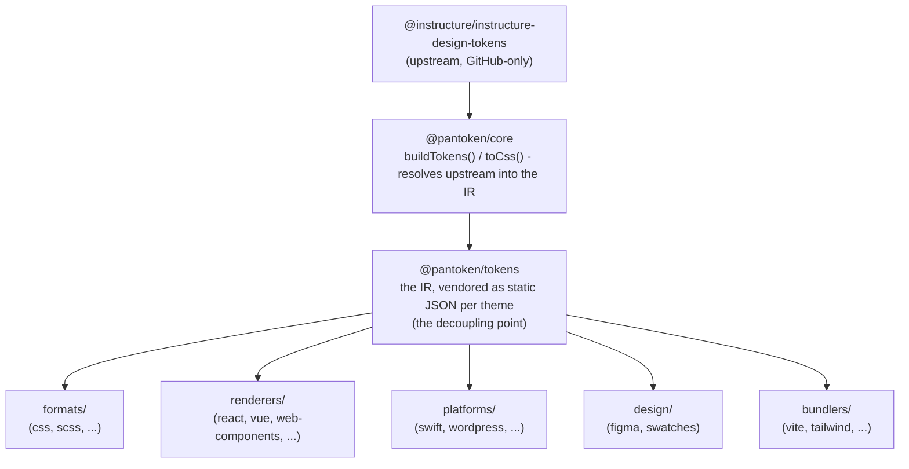

# 架構

pantoken 的一項工作：一次性解析 Instructure 的設計 tokens 與圖示，然後為每個目標重新塑形該模型。下列各層保持該重塑過程的正確性，並確保已發佈的套件不會攜帶任何僅限 GitHub 的上游依賴。

## 層級

- **`@pantoken/model`** 保持類型契約（type contracts），僅此而已。它是 `Token` 結構與插件契約的事實來源，且完全沒有依賴，因此任何套件都可以自由地依賴它。
- **`@pantoken/core`** 是唯一接觸上游來源的套件。它將 tokens 與圖示解析成典範的中繼表示（canonical IR）並渲染 CSS。
- **`@pantoken/tokens`** 在建置時將該 IR 以靜態 JSON 形式打包。這是解耦點：下游套件讀取 `@pantoken/tokens`，而非 `@pantoken/core`，因此 `npm i pantoken` 永遠不會去取用僅限 GitHub 的上游。
- **`@pantoken/utils`** 擔負共用輔助工具 —— `var(--x)` 解析器、參考用正規表達式、大小寫與顏色轉換，以及保持輸出與 IR 一致的漂移檢查（drift checks）。

## 為何要把 tokens 打包

上游的 token 套件放在 GitHub，而非 npm。如果每個下游套件都依賴它，`npm i pantoken` 對於沒有該存取權的人會失敗。取而代之，`@pantoken/tokens` 在建置時只解決一次上游並將結果寫到靜態 JSON。已發佈的套件攜帶該 JSON，因此可以從 npm 乾淨安裝、鎖定 semver，並支援離線使用。

## 存放桶（Buckets）

每個下游 bucket 是消費 IR 的一種方式：

- **formats/** — 將 tokens 轉成檔案（CSS、SCSS、Less、Stylus、DTCG）。
- **renderers/** — 框架與工具整合（React、Vue、Svelte、MUI、Pendo 等）。
- **bundlers/** — 建置工具的外掛與預設（Vite、Next、Tailwind、Panda、PostCSS、webpack）。
- **platforms/** — 原生與站點產生器目標（Swift、Kotlin、Rust、WordPress、Drupal）。
- **design/** — 提供給設計工具的 payload（Figma、色票）。
- **plugins/** — 擴展 token 或 CSS 輸出的可選轉換。參見 [Plugins](/guide/plugins)。

## 產生的輸出

每個輸出檔案的套件會將其寫入每個套件的 `generated/` 目錄，該目錄由建置程序重現，因此不會把任何生成的內容提交。工作區任務會驗證所有內容。參見 [Generated output](/guide/generated-output)。
